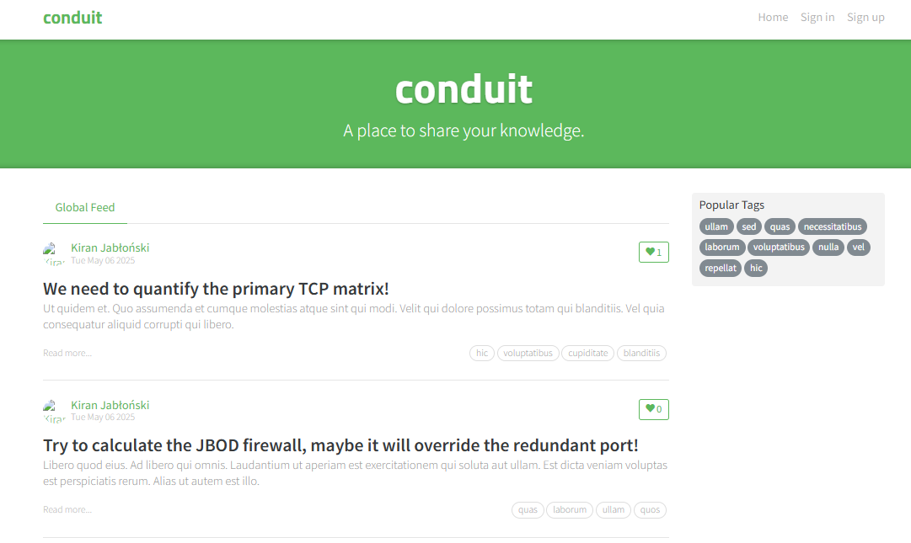
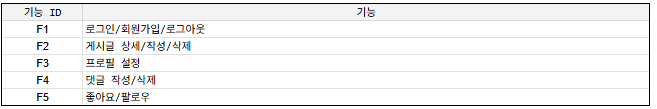
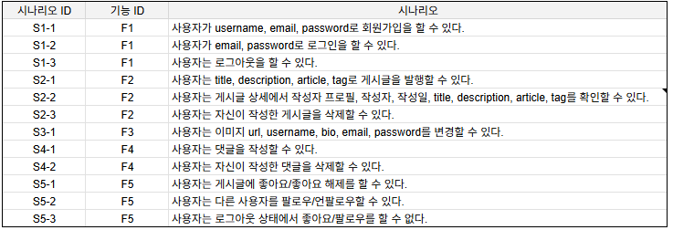
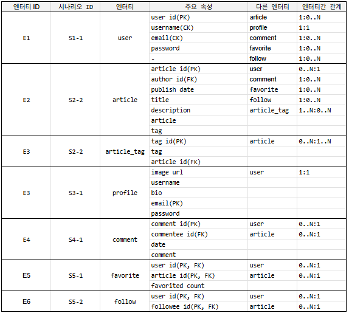
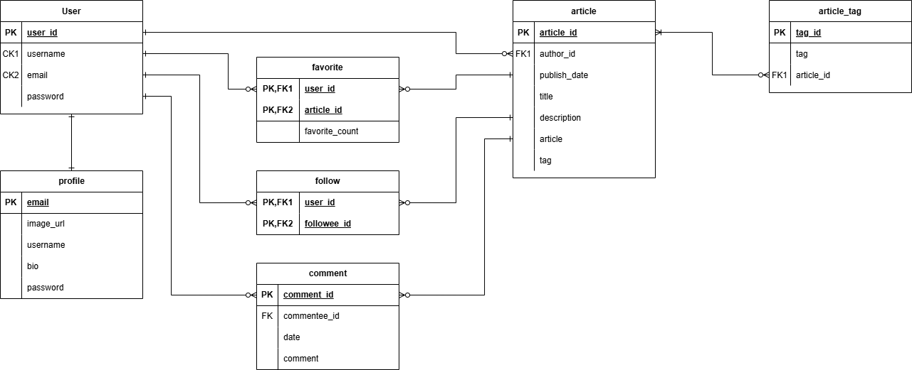
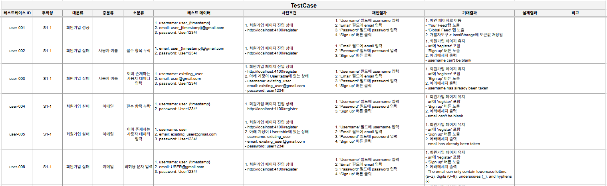

# 데이터 기반 테스트
## 개요
데이터 기반 테스트DDT(Data-Driven Testing) 역량을 강화하기 위해,  
RealWorld 사이트의 주요 기능을 분석하여 ERD를 작성하고 해당 ERD를 바탕으로 테스트케이스를 설계한다.

## 목적
- ERD 작성을 통해 서비스 구조와 기능 흐름을 파악
- 데이터 구조에 기반한 테스트 시나리오 설계 경험 확보
- 테스트 설계 시 필요한 엔터티 및 속성 간 관계 이해

## 사용 툴
* Google Spreadsheets : 테스트케이스 작성 및 시나리오 작성
* drawio : ERD 작성

## 순서
1. 주요 기능 분석

2. 시나리오 작성

3. 엔터티와 속성 확정, 관계 설정
    3.1. 엔터티 도출 및 속성 정제 및 정의

    * 기준
        - 고유 식별자 존재 여부
        - 속성 보유 여부
        - 다수의 인스턴스 존재 여부
        - 다른 엔터티와 관계 존재 여부
        - 기능 단위 테스트 필요 여부

    3.2. 엔터티와 속성 확정, 관계 설정  
    3.3. 필요시 정규화 적용(최소 3NF 까지)  
    3.4. PK/FK/CK 구분  

4. ERD 작성
    4.1. 엔터티 배치  
    4.2. 카디널리티 표현  

## 테스트케이스 설계 결과
1. 주요 기능  

2. 시나리오  

3. 엔터티와 속성, 관계표  

4. ER Diagram

5. Testcase  
  

[테스트케이스 설계 결과 전체 보기](https://docs.google.com/spreadsheets/d/1SxjCDiIXlvleXsjqzWHdibPLRzy_hQsP1JwZAsbmfLU/edit?usp=sharing)