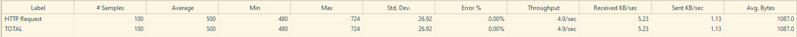
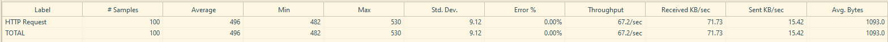
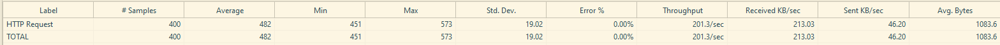
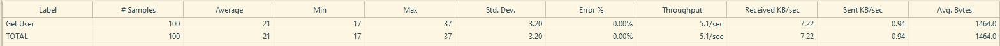
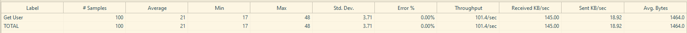
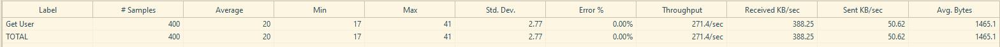

# JMeter - 로그인 후 인증된 요청 부하 테스트
: 로그인 후 사용자 정보를 받아오는 시나리오를 테스트한다.  
이후 부하를 점진적으로 증가시키며 성능을 확인한다.

* 테스트 목적
    * 로그인 API에서 토큰 받아오기
    * 토큰을 Authorization 헤더에 넣어 사용자 데이터 API 호출하기
    * 부하에 따른 성능지표 변화 확인하기

## 테스트 설정
### Thread Group
* Thread Group 1
    - Number of Thread : 100
    - Ramp-up period : 20
    - Loop : 1

* Thread Group 2
    - Number of Thread : 100
    - Ramp-up period : 1
    - Loop : 1

* Thread Group 3
    - Number of Thread : 200
    - Ramp-up period : 1
    - Loop : 2

<br/>

* 로그인 테스트 Sampler 설정
    - 대상 URL : https://reqres.in/api/login
    - 요청 방식 : POST
    - Body Data
        ```
        {
        "email": "eve.holt@reqres.in",
        "password": "cityslicka"
        }
        ```
    - HTTP Header 설정
        ```
        Content-Type: application/json
        ```
    - JSON Extractor 설정
        - path expression: $.token

<br/>

* 사용자 정보 요청 테스트 Sampler 설정
    - 대상 URL : https://reqres.in/api/users/2
    - 요청 방식 : GET
    - HTTP Header 설정
        ```
        Content-Type: application/json
        Authorization: Bearer ${token}
        ```

### 테스트 결과
* 로그인 테스트
    * 공통
        - Response 200 OK
        - Response Body: 토큰값 포함

    * Thread Group 1
    

    * Thread Group 2
    

    * Thread Group 3
    

<br/>

* 사용자 정보 요청 테스트
    * 공통
        - Response 200 OK
        - Response Body: 사용자 정보 포함

    * Thread Group 1
    

    * Thread Group 2
    

    * Thread Group 3
    

## 결과 분석
1. 모든 테스트의 표준편차가 평균 응답 속도의 50% 이내로, 서버 성능이 안정적인 상태임을 확인함

    * 로그인 테스트  
    : Thread 증가에도 평균 응답시간 변화율은 5% 이내로 안정적이며, 동시 사용자 증가에 따른 성능 저하가 크지 않음

        |Thread Group|평균 응답 속도(ms)|표준편차|
        |:--:|:--:|:--:|
        |1|500|26.92|
        |2|496|9.12|
        |3|482|19.02|
 
    * 사용자 정보 요청 테스트  
    : 응답 시간이 짧고, 부하 변화에도 성능이 거의 동일하게 유지됨.

        |Thread Group|평균 응답 속도(ms)|표준편차|
        |:--:|:--:|:--:|
        |1|21|3.20|
        |2|21|3.71|
        |3|20|2.77|

2. 동시 사용자 수가 증가함에 따라 에러 없이 API의 처리량이 지속적으로 증가하는 것을 확인함

    * 로그인 테스트  

        |Thread Group|에러율(%)|처리량(/sec)|
        |:--:|:--:|:--:|
        |1|0.00%|4.9|
        |2|0.00%|67.2|
        |3|0.00%|201.3|

    * 사용자 정보 요청 테스트 

        |Thread Group|에러율(%)|처리량(/sec)|
        |:--:|:--:|:--:|
        |1|0.00%|5.1|
        |2|0.00%|101.4|
        |3|0.00%|271.4|

테스트용 Open API를 사용하여 명확한 임계점을 확인하지 못함  
실제 환경에서는 최대 부하 조건에서 응답 지연, 에러율 확인 등 추가 분석 필요