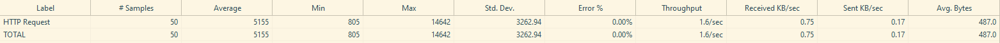
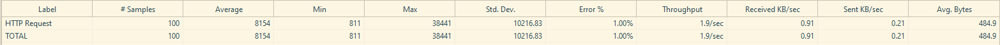

# JMeter 연습 - 기본 GET 요청 테스트
: JMeter를 사용하여 단순 GET 요청에 대해 부하를 주는 실습을 진행

* 테스트 목적 : JMeter 기본 사용법 익히기

## 테스트
### 테스트 1
* 정보
    - 대상  URL : https://httpbin.org/get
    - 요청 방식 : GET
    - Thread : 50
    - Ramp-up period : 20
    - Loop : 1

* 테스트 결과

### 테스트 2
* 정보
    - 대상  URL : https://httpbin.org/get
    - 요청 방식 : GET
    - Thread : 100
    - Ramp-up period : 20
    - Loop : 1

* 테스트 결과

## 결과 분석
* 두 테스트 모두 응답속도의 편차가 크고 서비스 성능이 불안정함
    * 테스트1 : 최소 응답속도 805ms, 최대 응답속도 14642ms
    * 테스트2 : 최소 응답속도 811ms, 최대 응답 속도 38441ms

* Thread 수 2배 증가 시 평균 응답시간 증가 (5155ms -> 8154ms, 약 1.58배)
    * 테스트1 : Thread 50개
    * 테스트2 : Thread 100개

* 테스트 2에서 502 Bad Gateway 에러 발생