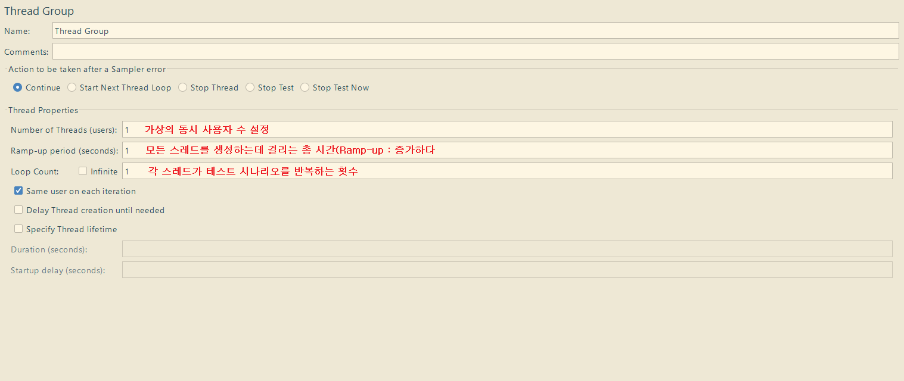
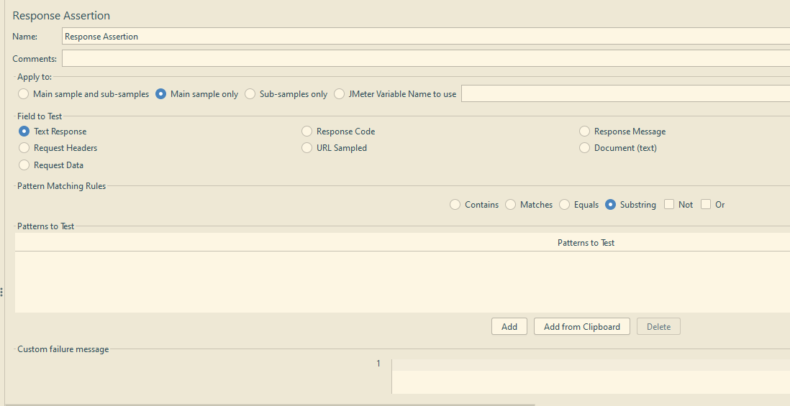
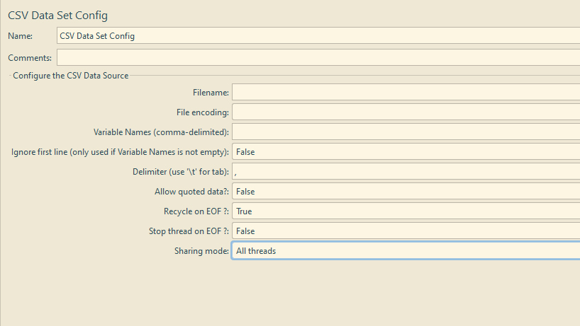
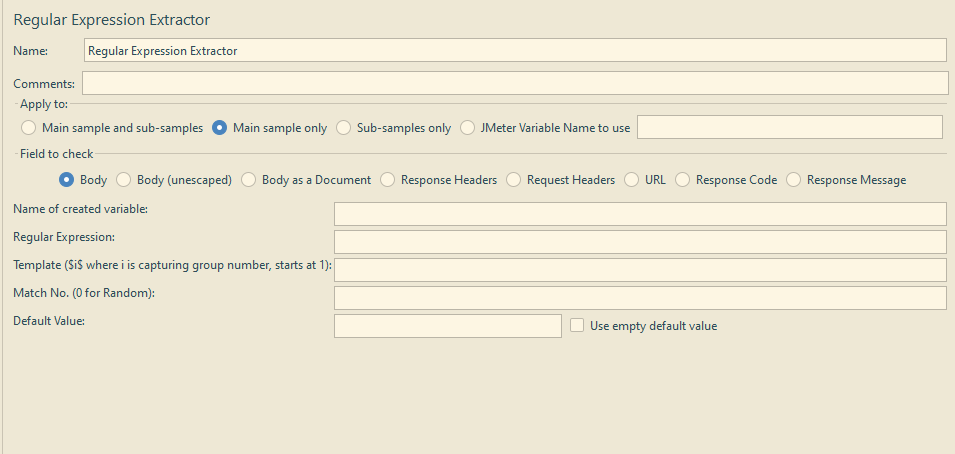

# JMeter
* 지원 프로토콜
    * Web  : HTTP, HTTPS (Java, NodeJS, PHP, ASP.NET, …)
    * WebServices  : SOAP / REST
    * Database via JDBC
    * FTP, LDAP, JMS, Mail (SMTP, POP3, IMAP), TCP, OS Native processes 등

* API 부하테스트 전용 툴, SPA 테스트는 어려움

<br/>

## CLI 모드(Non-GUI 모드)
: 적은 리소스로 가상 사용자 생성 가능, 자동화 및 CI/CD 연동에 적합

* 실행 명령어
    ```
    터미널에서 실행
    jmeter.bat -n -t <testplan.jmx> -l <results.jtl> -e -o <report_output_dir> 
    ```

* 실행 없이 리포트 생성 명령어
    ```
    터미널에서 실행
    jbeter.bat -g <results.jtl> -o <report_output_dir>
    ```

* 명령어 옵션
    * -n : Non-GUI 모드
    * -t : Test Plan(.jmx) 지정
    * -l : 결과 파일(.jtl, JMeter Test Results Data File) 저장 경로 지정
    * -e : 테스트 종료 후 HTML 리포트 생성
    * -g : 기존 결과 파일을 기반으로 HTML 리포트를 생성
    * -o : 지정된 빈 디렉터리에 HTML 리포트를 저장

<br/>

## GUI 모드
: 메모리, CPU 사용량이 많아 대규모 실행 시 CLI 모드 사용 권장

* 실행 방법
    * Windows  : jmeter.bat 실행(apache-jmeter-5.6.3\bin\jmeter.bat)
    * Linux/macOS  : 터미널에서 명령어로 실행(apache-jmeter-5.6.3\bin\jmeter.sh)
        ```
        cd apache-jmeter-5.6.3\bin
        jmeter.sh
        ```

<br/>

### 구성 요소
* Test Plan
: 테스트 요소(Element)들을 논리적으로 그룹화

<br/>

* Thread Group
: 가상 사용자 그룹 정의, JMeter 실행 시 Thread Group 단위로 실행됨

    

<br/>

* Sampler
: 실제 요청을 생성하여 서버로 전송

    * HTTP Request  : HTTP 요청 전송
    * FTP Request : FTP 서버 파일 업로드/다운로드
    * JDBC Request : 데이터베이스 쿼리 실행
    * TCP Sampler : TCP 소켓 통신 테스트
    * SMTP Sampler : 이메일 발송 테스트

<br/>

* Config Element
: 요청에 필요한 기본값 설정
    * HTTP Header Manager : HTTP 요청 헤더 설정
        ```
        e.g.
        Content-Type: application/json
        Authorization: Bearer ${token}
        ```
    * HTTP Request Defaults : HTTP 요청의 기본값 설정    
    * HTTP Cookie Manager : 서버로부터 받은 Set-Cookie 헤더를 저장하여 이후 자동 전송
    * CSV Data Set Config : 외부 CSV 파일에서 데이터를 읽어와 동적 파라미터로 사용
    * User Defined Variables : 테스트 계획 내에서 사용할 변수 정의
        ```
        e.g.
        Name: targetHost, Value: www.google.com
        > 이후 ${targetHost} 형식으로 변수 사용 가능
        ```

<br/>

* Listener
: 요청 결과를 수집, 분석 및 시각화
    * View Results Tree : 각 요청/응답 상세 정보 확인, 디버깅용
    * Summary Report : 전체 통계 요약 (Avg, Min, Max, Error%, Throughput 등)
    * Aggregate Report : Summary Report와 유사 + Percentile 정보
    * Backend Listener : 결과를 외부 시스템(InfluxDB 등)으로 전송 (실시간 모니터링)

<br/>

* Assertions
: Sampler의 응답 검증  
    > <span style="color:darkgray">**일반적인 부하테스트는 리턴값을 검증하지 않는다.  
    API 성능 테스트의 경우 응답값을 확인한다.**</span>

    * Response Assertion : 응답 코드, 텍스트 내용, 헤더 등을 검증
    

    * Duration Assertion : 요청의 최대 허용 응답 시간 검증
    * Size Assertion : 응답 크기를 검증

<br/>

* Timer
: Think Time 입력, Timer는 모든 Sampler 실행 전에 적용됨
    * API 순차 실행 확인 가능
    * API 개폐 시점으로 인한 오버플로우 확인 가능

<br/>

* Test Fragment : 모듈화를 위한 컨테이너의 역할
* Pre Processors : 테스트를 위한 후처리
* Post Processors : 테스트를 위한 전처리
* Logic Controller : Sampler의 논리 로직을 제어하여 복잡한 시나리오 구현이 가능하도록 함

<br/>

## JMeter Functions
: 간단한 데이터 생성이나 파일 읽기에 유용  
[참고 : apache functions manual](https://jmeter.apache.org/usermanual/functions.html)

* 자주 사용되는 Functions
    * __RandomString : 지정된 길이에 맞게 랜덤 문자열 생성
        ```
        ${__RandomString(문자열 길이, 사용 문자, 변수명)}   // 필수값 : 문자열 길이
        ``` 
    * __threadNum	: 현재 쓰레드 번호 반환, 쓰레드별 구분된 값 구성 가능
        ```
        ${__스레드번호}
        ```
    * __time : 현재 시간 반환
    * __UUID : 고유한 UUID(범용 고유 식별자) 생성
    * __counter : 증가하는 숫자 생성, 순번 또는 반복 제어 변수 등으로 사용 가능

<br/>

# JMeter 세부 구성 항목
## Logic Controller
* Simple Controller  
: 하위 요소들을 논리적으로 그룹화, 로직에 영향을 주지 않으며 스크립트 가독성 향상을 위해 사용  
Controller를 중첩하면 로직처럼 활용 가능

<br/>

* Loop Controller  
: 하위 요소들을 지정된 횟수만큼 반복 실행
    * Loop Count : 숫자, 변수, 프로퍼티를 사용하여 설정
    * Infinite : 무한 실행 여부 설정

<br/>

* If Controller  
: 조건이 참일 경우에만 하위 요소 실행
    * Expression : JavaScript, JMeter 변수/함수 등을 사용하여 실행 조건 입력
    * Interpret Condition as Variable Expression? : Expression 필드에 입력된 문자열 자체를 변수 이름으로 간주할것인지 설정
    * Evaluate for a children? : 해당 컨트롤러 하위 요소를 실행하기 전, 매번 Expression의 조건을 평가할것인지 설정

<br/>

* While Controller  
: 조건이 참인 동안 하위 요소 반복 실행, 조건이 거짓이거나 Break를 만나면 반복 중단
    * Condition

<br/>

* Throughput Controller  
: 하위 요소들의 처리율 제어, 특정 비율의 사용자만 특정 작업을 수행하도록 시나리오 설정 가능

    * Throughput : 목표 처리율 값

    * Based on : 실행 모드 설정
        * Percent Executions : 전체 실행 횟수 중 Throughput 필드에 입력된 비율(%)만큼만 하위 요소 실행
        * Total Executions : 해당 Controller 하위 요소들이 Throughput 필드에 입력된 횟수만큼 실행

    * Per User : 처리율 계산을 각 스레드(user)별로 할것인지, 모든 스레드를 합산하여 할것인지 설정

<br/>

* Transaction Controller  
: 하위 Sampler들을 하나의 논리 트랜잭션으로 그룹화하여 전체 수행 시간 측정  
리포트에서 주요한 지표가 됨

    * Generate parent sample : Transaction Controller 단위로 Sample을 생성하여 하위 효소들의 실행 결과를 묶어서 보여줄것인지 설정, 대부분 체크함

    * Include duration of timer and pre/post processors in generated sample : timer, pre/post processors의 실행 시간까지 트랜잭션 총 시간에 포함할것인지 설정, 일반적으로 체크함

<br/>

* Include Controller  
: 외부 .jmx 파일을 현재 Test Plan에 포함시키는 Controller  
대류모 프로젝트에서 파일을 분리하여 관리할때 용이함
    * Filename : 포함할 외부 .jmx 파일 경로 입력

<br/>

* Module Controller  
: Test Fragment에 정의된 모듈을 호출하여 실행시키는 Controller  
Include Controller보다 구조파악하기 쉬움

<br/>

## Test Fragment
: 재사용하려는 Sampler, Logic Controller, Config Element 등의 집합을 담는 컨테이너

<br/>

## Config Element
### CSV Data Set Config
: 테스트 데이터를 외부 CSV 파일에서 읽어와 변수에 할당



* Filename : .jmx 파일을 기준으로 상대 경로 사용 권장(../data.csv)
* File encoding : CSV 파일의 인코딩

* Variable Names : CSV 파일의 속성명, 쉼표(,)로 구분하여 작성
* Ignore first line : Variable Names가 비어있을때 첫 줄(헤더)를 무시할것인지 선택

* Delimiter : CSV 파일의 구분자
* Allow quoted data? : 데이터에 쌍따옴표 사용 여부 (True : "Data", False : Data)

* Recycle on EOF? : CSV 파일의 마지막 행에 도달 시, 1행부터 다시 실행할 것인지 선택
* Stop thread on EOF? : CSV 파일의 마지막 행에 도달하고 Recycle on EOF가 False일때 스레드를 중지시킬것인지 선택

* Sharing mode : 스레드 간 데이터 할당 방식 선택
    * All threads  
    : 생성된 모든 스레드가 파일을 공유  
    각 스레드가 실행될 때마다 파일의 다음 행 데이터를 순차적으로 가져감  
    중복이 안되기 때문에 고유한 사용자 계정 할당 등에 적합

    * Current thread group  
    : 스레드 그룹 내에서 CSV 파일 공유  
    각 스레드가 실행될 때마다 파일의 다음 행 데이터를 순차적으로 가져감
    
    * Current thread  
    : Thread group 내의 Thread(각 사용자)별로 파일을 처음부터 끝까지 읽음
    
    * identifier  
    : 특정 식별자를 공유하는 요소들끼리만 파일 공유

<br/>

## Post Processors
### Extractor
> <sapn style="color:darkgray">**Correlation(상관관계)  
: 토큰, 세션 ID, 동적 URL 파라미터값 등 서버에서 생성된 동적 값을 Extract하여 변수에 저장, 변수를 후속 요청에 Inject 하는 과정**</span>

* JSON Extractor  
: JSON 응답에서 JSON Path 표현식을 사용하여 값 추출

* JSON JMESPath Extractor  
: JSON 응답에서 JMESPath 표현식을 사용하여 값 추출

* CSS Selector Extractor  
: HTML 응답에서 CSS 선택자를 사용하여 요소를 찾고 속성값 추출

* XPath Extractor  
: 기본 XML, XHTML 응답에서 XPath 1.0 표현식으로 요소를 찾고 속성값을 추출

* XPath2 Extractor  
: XPath Extractor보다 정교한 표현식 사용 가능  
조건문, 정규식 필터링과 같이 복잡한 XML 응답 처리나 namespace를 포함한 문서에 적합

* Regular Expression Extractor(정규식 추출기)
: 정규 표현식을 사용하여 응답 데이터 추출 

    

    * Name of created variable : 변수명 
    * Regular Express : 사용할 정규식, 추출할 부분을 ()에 입력
    * Template : 추출할 그룹이 여러개일때 어떤 그룹을 변수에 저장할지 지정
        * \$1$ : 첫번째 그룹
        * \$0$ : 전체 매칭된 문자열
    * Match No. : 매칭 결과를 번호로 입력
        * 1 : 첫번째 매칭 결과
        * 0 : 랜덤 매칭 결과
        * -1 : 모든 매칭 결과
    * Default Value : 매칭되는 값이 없을 경우 변수에 할당할 기본값

<br/>

# 결과 분석 및 튜닝
* 결과 분석 : JMeter 결과와 서버 모니터링 데이터를 연관지어 분석해야 함
* 병목 지점 : 시스템 설계상의 오류/용인으로 인해 시스템 전체 성능을 제한하는 특정 지점

## JMeter 지표 확인
* JMeter Test Results Data File(.jtl)  
: CSV 또는 XML 형식으로 작성된 결과 파일

    * 설정
    : jmeter.properties 파일에서 기본 포맷 및 저장 필드 변경 가능
        * jmeter.save.saveservice.output_format=csv
        * jmeter.save.saveservice.timestamp_format=ms

<br/>

* 주요 지표와 권장값

    |지표|설명|기준값(권장)|참고|
    |:---|:---|:---|:---|
    |Average Response Time|평균 응답 시간|≤ 1초 (1000ms)|사용자 경험 향상
    |Median<br/>(50th Percentile)|중앙값 응답 시간|평균과 유사해야 함|응답 시간의 일관성 확인<br/>평균 응답 시간보다 Outlier에 덜 민감함
    |90th Percentile|90%의 요청이 이 시간 이하로 처리됨|평균의 1.5배 이내|응답 시간의 일관성 확인
    |Standard Deviation|응답 시간의 표준 편차|평균의 50% 이하|응답 시간의 안정성 평가
    |Error %|실패한 요청의 비율|0%|안정성 확보<br/>리소스 한계 초과, 잘못된 요청 발생 시 증가
    |Throughput|초당 처리 요청 수 (TPS)|높을수록 좋음|시스템 처리 능력 평가<br/>Saturation Point 확인이 중요
    |Latency|요청 후 첫 응답까지의 시간|낮을수록 좋음|네트워크 지연 확인
    |Connect Time|연결 수립 시간|낮을수록 좋음|서버 연결 속도 평가

<br/>

    * Outlier(이상치) : 평균치에서 크게 벗어나서 다른 대상들과 확연히 구분되는 표본
    * Percentile : 서비스 수준 목표(SLO, Service Level Objective)나 서비스 수준 협약(SLA, Service Level Agreement)을 설정하는데 사용됨

<br/>

### Error%
* jmeter.log 확인
* Assertion Failures : .jtl 파일의 failureMessage 확인
* 서버 로그 확인
* 리소스 확인 : CPU, 메모리, HDD, Network, Connection Pool 등

<br/>

### 처리량
* Hits Per Second : 시간에 따른 작업 처리 수 그래프

* 이상적인 Hits Per Second


* 임계점에 도달한 Hits Per Second

    * 시스템 최대 처리량 도달
    * 병목 발생

* 시간이 지남에 따라 Throughput 감소 원인
    * 시스템 부하 누적
    * 메모리 누수
    * 병목 발생

* 급격한 Throughput 변동 원인
    * Garbage Collector 영향
    * 외부 요인
    * 테스트 환경 불안정

<br/>

### 응답 시간
* Response Time over Time : 테스트 시간에 따른 응답 시간


* 이상적인 Response Time over Time : 응답 시간이 일정하게 유지

* 시간이 지남에 따라 응답시간 증가 원인
    * 시스템 부하 누적
    * 메모리 누수
    * DB 성능 저하

* 주기적인 응답시간 증가 원인
    * Garbage Collector 영향

<br/>

## 서버 자원 모니터링
### CPU, 메모리 모니터링
* 리눅스 명령어
    * top : 리눅스 기본 제공
    * htop : 설치 필요, 사용자 친화적 인터페이스 제공
    * vmstat : virtual memory stat, 프로세스, 메모리, 페이징, I/O 블럭, CPU 활동 정보 출력

<br/>

* top/htop  

    |항목|의미|주요 확인 사항|
    |:---|:---|:---|
    |**%CPU**|프로세스별 CPU 사용률|CPU 병목, 단일 코어 포화 여부 확인|
    |**%MEM**|프로세스별 메모리 사용률|메모리 누수, 프로세스 급증 감지|
    |**load average**|CPU 사용/대기 작업 수 (1, 5, 15분 평균)|1분 평균이 CPU 코어 수보다 높으면 과부하 가능성|
    |TIME+|누적 CPU 시간|CPU 자원을 오래 점유하는 작업 식별|
    |**RES**|실사용 메모리 크기|메모리 누적 증가 시 누수 의심|
    |**VIRT**|가상 메모리 크기|메모리 누적 증가 시 누수 의심|

<br/>

* vmstat(virtual memory stat)

    |구분|항목|의미|주요 확인 사항|
    |:---|:---|:---|:---|
    |process|r|실행 대기 중인 프로세스 수|r값이 CPU 코어수 초과 시 CPU 병목 가능성|
    |memory|**free**|사용 가능한 메모리|줄어들고 있으면 스왑 사용 임박,<br/>OOM 발생 가능성|
    |swap|**si / so**|swap in/out (디스크로 메모리 스왑)|so 값이 0 초과 시, 심각한 메모리 병목 상태|
    |system|cs|Context Switch 횟수|멀티스레드 부하 가능성|
    |cpu|**us / sy / id**|CPU 사용량|us+sy가 90% 이상이면 CPU 과부하<br/>id가 0%이면 과부하 가능성<br/>sy만 높은 경우 System Call 과다|

    * r : run queue, 실행 큐
    * Swapping : **물리적 메모리(RAM)가 부족할 때** 시스템 다운을 방지하기 위해 임시로 HDD 일부를 사용하는 기술
        * Swap Out(so) : RAM > HDD로 데이터 이동
        * Swap In(si) : HDD > RAM으로 데이터 이동

    * context switching : CPU/코어에서 실행중이던 프로세스/스레드가 다른 프로세스/스레드로 교체되는 것, 멀티태스킹 환경에서 CPU가 다른 작업으로 전환할 때 발생
    
    * us : User CPU, 사용자가 실행한 애플리케이션이 CPU를 쓰는 비율
    * sy : System CPU, 파일 읽기, 네트워크 처리 등으로 커널/운영체제가 CPU를 사용하는 비율
    * id : Idle CPU, 아무것도 하지 않는 CPU 비율

<br/>

### 네트워크 모니터링
* 리눅스 명령어
    * netstat : 네트워크 연결 확인
        * -s : TCP 재전송 횟수, 실패, 연결 수락 실패 등 네트워크 통계 확인
        * -anp grep <PORT> : 특정 포트의 연결 상태 확인
    * ss : netstat 대체 명령어, 더 빠르고 자세한 네트워크 연결 정보 출력
    * iftop : 실시간 트래픽 모니터링
    * nload : 간단한 네트워크 대역폭 시각화

* 네트워크 지연이 원인
    * 웹소켓 과다
    * TCP의 네트워크 커넥션 상태가 안좋은 경우
    * 인증서의 버전이 다른경우(버전별로 속도 상이함)
    * 캐싱전략 등

<br/>

### DISK 모니터링
* 리눅스 명령어
    * vmstat
    * iostat : Input/Output Statistics, 디스크, CPU의 사용량과 I/O 병목 여부를 분석 가능한 유틸리티
        * -x : iostat 데이터 확장 통계

* vmstat(virtual memory stat)

    |구분|항목|의미|주요 확인 사항|
    |:---|:---|:---|:---|
    |io|bi|디스크에서 메모리로 읽는 양||
    |io|bo|메모리에서 디스크로 쓰는 양||
    |cpu|ws|I/O wait|bi, bo, wa 모두 높은 경우 디스크 병목 가능성|

    * bi : Block In, 파일 접근, DB read 등 읽기 작업
    * bo : Block Out, 로그, 캐시, DB flush 등 쓰기 작업

* iostat -x
    |항목|의미|주요 확인 사항|
    |:---|:---|:---|
    |await|전체 평균 응답시간(ms)|읽기 + 쓰기 평균으로, 디스크 응답 속도 전반 확인|
    |aqu-sz|대기 중인 평균 요청 수|>1.0이면 디스크가 요청을 다 처리하지 못함 → 병목 신호|
    |%util|디스크 사용률(%)|>80% 지속 시 디스크 과부하 가능성 큼|
    |%iowait|CPU가 디스크 응답을 기다린 시간|id는 높은데 iowait은 길 경우 디스크 병목 의심 근거
    
<br/>

